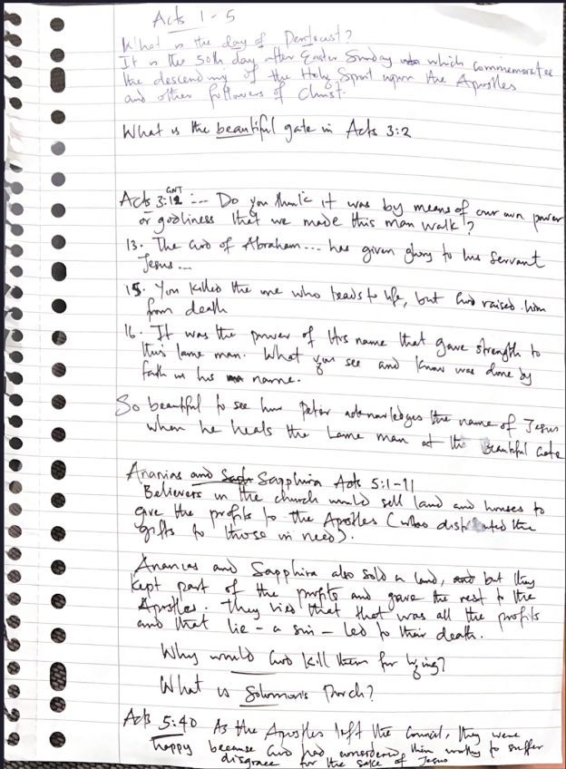
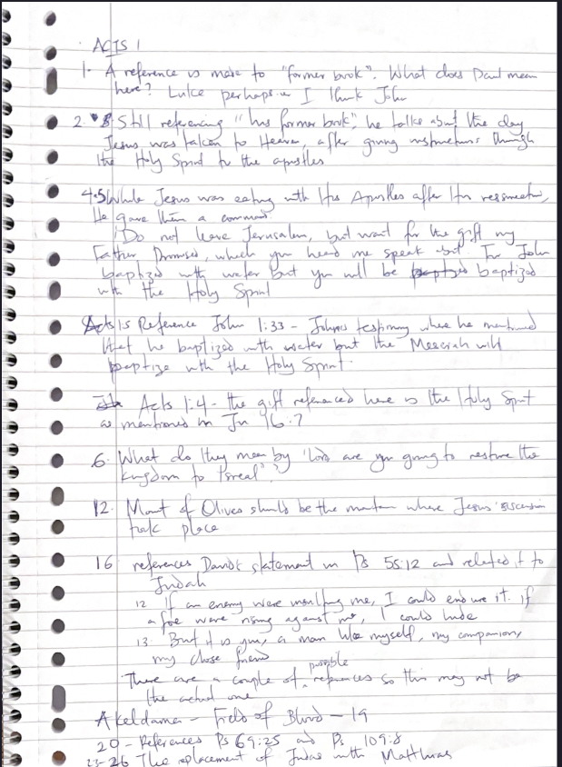

Part of my plans for [building a better relationship with God](/plans-for-better-relationship-with-god) and learning more about God this year is Reading the Bible with context. And oh my...it's work 😭

...but, beautiful!

## The work

I picked up the book of Acts again. The first time I read through Acts was months ago. By reading with context this time around, I realized I spent between 45mins to 1 hour on chapter 1. It felt like the chapter wasn't going to end 🤣 And it's just 26 verses.

When I read chapter 1 months ago, I know I didn't spend up to 20mins.

So what's the difference between then and now?

Well, before when I read Acts 1:1-5, here are my notes:

As you can see here, I have the notes for 5 chapters on 1 page. I don't even have notes for chapter 1. Notes I had were on things that just stood out to me while reading. Reading through chapter 1, it was like I understood every verse. I didn't think of questions or try to understand unclear things. I just read, and tried to pick a theme I could pray with afterward.

Now, here are my notes for Acts 1:

This is one page, for just Acts 1. In verse 1 of Acts chapter 1, Luke mentioned "former book", and as you can see in my notes, I already have notes for verse 1--the first verse.

When I read Acts 1 before, I probably just assumed "Luke must have meant the book of Luke or John" and I just kept reading without confirming.

But now, because context, I already asked myself "What does 'former book' here mean?". You won't believe that this took me like 5 minutes to finally know it was the book of John. I had to read a few verses of Acts to see the message from the former book he was talking about. Then I had to go to the last chapters of the book of Luke, and the book of John before I finally realized that he was referring to John.

So you see the work involved here...having to read a brief of previous books to understand one verse (or a couple of them).

And it doesn't stop there. Before, when I read the Bible and there was a quote of a prophecy or a saying from the Old Testament, I don't go to the Old Testament; I only read the quoted text. But now, when there's a reference to a quote from Isaiah 53:12 (for example), I won't only read the quote but I would go to Isaiah chapter 53, and read the whole chapter. That chapter may not give me the entire context I need (as I didn't read the previous chapters) but it will definitely help my understanding compared to just reading verse 12--one verse amongst other verses in the chapter.

And another thing with context is that you have to keep remembering the context as you read more chapters. Even in chapter 12, you have to remember where the story began in chapter 1. Thinking that chapter 12 is standalone is not good practice. It is a continuation of chapter 11, which in turn continues from chapter 10, and so on until chapter 1, the origin of that book.

So what I do is before reading a chapter, I try to remember the context that I've gathered so far in the previous chapters of that book.

See...work! For some questions, I don't get the answer immediately. For some, I don't even get the answer through all my reading. I just note it down for the future. And though, this could make studying the Bible more overwhelming, it is a beautiful way to learn about God.

## The Beauty

[Phil 4:13](https://www.bible.com/en-GB/bible/111/php.4.13) says:

> I can do all this through him who gives me strength.

I've always thought that this verse means I can do anything--succeed in my career, experience breakthroughs, name it--through Christ who strengthens me. But recently, I learned that this verse was taken out of context from how it was actually used.

Don't get me wrong; this is not a bad prayer. It's a good one. But stemming from this verse, there is a different context applied to it. Now here's the right context in [Phil 4:10-12](https://www.bible.com/en-GB/bible/111/php.4.10-12):

> 10. I rejoiced greatly in the Lord that at last, you renewed your concern for me. Indeed, you were concerned, but you had no opportunity to show it.
> 11. I am not saying this because I am in need, for I have learned to be content whatever the circumstances.
> 12. I know what it is to be in need, and I know what it is to have plenty. I have learned the secret of being content in any and every situation, whether well fed or hungry, whether living in plenty or in want.

As you see here, verse 13 is a declaration that expresses "I can be content through him who gives me strength with the little I have".

Context improves understanding, which brings beauty as we learn about God and his manifestation in the different stories accounted for in the Bible. You could imagine my biggest surprise two weeks ago when I learned that I've been using Phil 4:13 out of context.

As context improves understanding, it also improves your prayer. You're able to apply patterns in the Bible to your life, and pray accordingly based on the knowledge you've acquired.

It's also interesting to know "what exactly made Paul make this statement" or "what made Jonah confident about this or that". It's even more interesting to learn for yourself and have fresh views about something of which your only view has been based on what you were told by someone (pastor, friend).

## Wrap up

It's been a journey this year wanting to know more about God and spending more time in study. It's tiring on some days, even though yes, I learn better this way. Two days ago I was reading a chapter, and my goal was to get to the end. I got to verse 35 or so, after already studying for over 45 minutes, then I flipped to the next page, saw that there were like 30 more verses, and then I said "really? you're still not done? nahhhh...I'll continue tomorrow" 🤣

Reading with context is not me pressuring myself to know about God. It's simply an approach I have to take to achieve my main goal--knowing God better. Along with studying, I also pray for wisdom and revelation of God as I do not want to read and apply everything logically.

I hope this encourages you and gives you some insights on how to approach studying the Bible.
